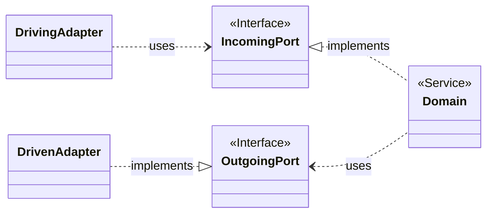

# 7. Ports and Adapters architecture

Date: 2022-06-21

## Status

Accepted

## Context

With a layered architecture there is no natural mechanism to detect when logic leaks between layers.
We aim for an architecture that

- provides solid boundaries in the system, keeping unrelated things well partitioned
- supports TDD
- drives designs towards SOLID principles
- makes change easy

## Decision

We are going to implement the [Ports and Adapters (Hexagonal) architecture](https://alistair.cockburn.us/hexagonal-architecture/) going forward.

Schematic view:

The core domain package in the center must not have outwards pointing dependencies whatsoever and
input/output can only reach/leave it through ports, that is interfaces provided by the core;
these interfaces in turn are to be implemented by adapters.

The application's source code is structured accordingly, with the following packages:

- `domain`: domain entities/business logic
- `adapter`: primary/driving and secondary/driven adapters

## Consequences

With a Ports and Adapters (Hexagonal) Architecture we are more easily able to isolate the core logic
of our application from outside concerns so that

- changing data source details doesn't have a significant impact to the codebase
- verifying business logic doesn't rely on protocols that can easily change
- e.g. testing becomes natural, mocking dependencies is easy

Almost a byproduct of this architecture is better adherence to the Single Responsibility Principle (SRP)
as well as Dependency Inversion.

To avoid accidental leakage between application/infrastructure and domain layers we are going to
implement an architecture fitness test. Using [ArchUnit](https://www.archunit.org) the desired
architectural constraints can be enforced.
