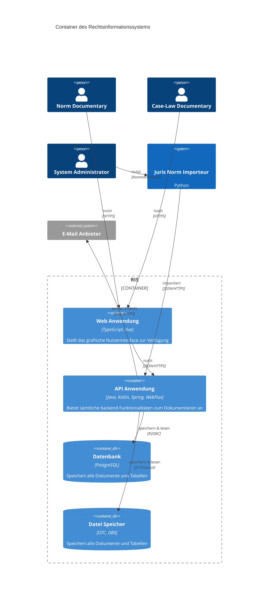

# RIS container C4 model

```mermaid
C4Context
      title Container des Rechtsinformationssystems

      Person(person_norms_documentary, "Norm Documentary")
      Person(person_caselaw_documentary, "Case-Law Documentary")
      Person(person_admin, "System Administrator")

      Container_Boundary(context_ris, "RIS") {
        Container(container_frontend, "Web Anwendung", "TypeScript, Vue", "Stellt das grafische Nutzerinterface zur Verfügung")
        Container(container_backend, "API Anwendung", "Java, Kotlin, Spring, WebFlux", "Bietet sämtliche backend Funktionalitäten zum Dokumentieren an")
        ContainerDb(container_database, "Datenbank", "PostgreSQL", "Speichert alle Dokumente und Tabellen")
        ContainerDb(container_file_storage, "Datei Speicher", "OTC, OBS", "Speichert alle Dokumente und Tabellen")
      }

      System(system_norm_importer, "Juris Norm Importeur", "Python", "Ließt Juris Datenbestände ein und wandelt sie in Normen um")
      System_Ext(system_mail_provider, "E-Mail Anbieter", "")

      Rel(person_norms_documentary, container_frontend, "nutzt", "HTTPS")
      Rel(person_caselaw_documentary, container_frontend, "nutzt", "HTTPS")
      Rel(person_admin, system_norm_importer, "nutzt", "Kommandozeile")
      Rel(container_frontend, container_backend, "nutzt", "JSON/HTTPS")
      Rel(container_backend, container_database, "speichern & lesen", "R2DBC")
      Rel(container_backend, container_file_storage, "speichern & lesen", "S3 Protocol")
      Rel(container_backend, system_mail_provider, "sendet E-Mails", "XML/HTTPS")
      Rel(system_norm_importer, container_backend, "importiert", "JSON/HTTPS")
```
