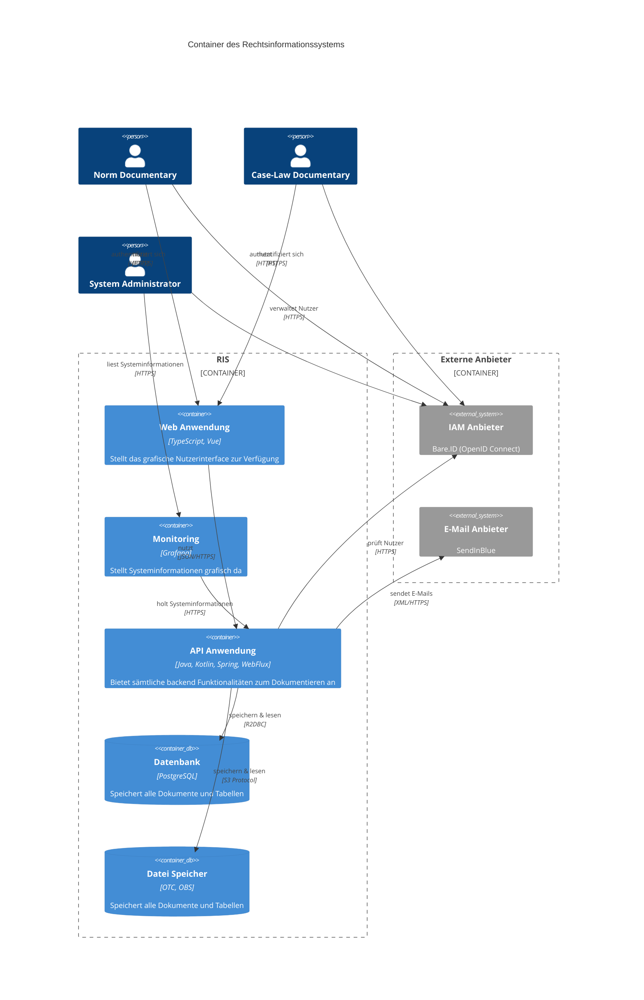

# RIS container C4 model

```mermaid
C4Context
      title Container des Rechtsinformationssystems

      Person(person_norms_documentary, "Norm Documentary")
      Person(person_caselaw_documentary, "Case-Law Documentary")
      Person(person_admin, "System Administrator")

      Container_Boundary(context_ris, "RIS") {
        Container(container_frontend, "Web Anwendung", "TypeScript, Vue", "Stellt das grafische Nutzerinterface zur Verfügung")
        Container(container_monitoring, "Monitoring", "Grafana", "Stellt Systeminformationen grafisch da")
        Container(container_backend, "API Anwendung", "Java, Kotlin, Spring, WebFlux", "Bietet sämtliche backend Funktionalitäten zum Dokumentieren an")
        ContainerDb(container_database, "Datenbank", "PostgreSQL", "Speichert alle Dokumente und Tabellen")
        ContainerDb(container_file_storage, "Datei Speicher", "OTC, OBS", "Speichert alle Dokumente und Tabellen")
      }
      
      Container_Boundary(context_external_provider, "Externe Anbieter") {
        System_Ext(system_iam_provider, "IAM Anbieter", "Bare.ID (OpenID Connect)")
        System_Ext(system_mail_provider, "E-Mail Anbieter", "SendInBlue")
      }
      
      Rel(person_norms_documentary, container_frontend, "nutzt", "HTTPS")
      Rel(person_caselaw_documentary, container_frontend, "nutzt", "HTTPS")
      Rel(person_admin, system_iam_provider, "verwaltet Nutzer", "HTTPS")
      Rel(container_frontend, container_backend, "nutzt", "JSON/HTTPS")
      Rel(container_backend, container_database, "speichern & lesen", "R2DBC")
      Rel(container_backend, container_file_storage, "speichern & lesen", "S3 Protocol")
      Rel(container_backend, system_mail_provider, "sendet E-Mails", "XML/HTTPS")
      Rel(person_norms_documentary, system_iam_provider, "authentifiziert sich", "HTTPS")
      Rel(person_caselaw_documentary, system_iam_provider, "authentifiziert sich", "HTTPS")
      Rel(container_backend, system_iam_provider, "prüft Nutzer", "HTTPS")
      Rel(container_monitoring, container_backend, "holt Systeminformationen", "HTTPS")
      Rel(person_admin, container_monitoring, "liest Systeminformationen", "HTTPS")

      UpdateRelStyle(person_norms_documentary, container_frontend, $offsetY="-80", $offsetX="-75")
      UpdateRelStyle(person_caselaw_documentary, container_frontend, $offsetY="-80", $offsetX="0")
      UpdateRelStyle(person_norms_documentary, system_iam_provider, $offsetY="-80", $offsetX="-380")
      UpdateRelStyle(person_caselaw_documentary, system_iam_provider, $offsetY="-80", $offsetX="-275")
      UpdateRelStyle(person_admin, container_monitoring, $offsetY="-80", $offsetX="-105")
      UpdateRelStyle(person_admin, system_iam_provider, $offsetY="-80", $offsetX="-75")
      UpdateRelStyle(container_monitoring, container_backend, $offsetX="-130")
      UpdateRelStyle(container_frontend, container_backend, $offsetX="-85")
```
