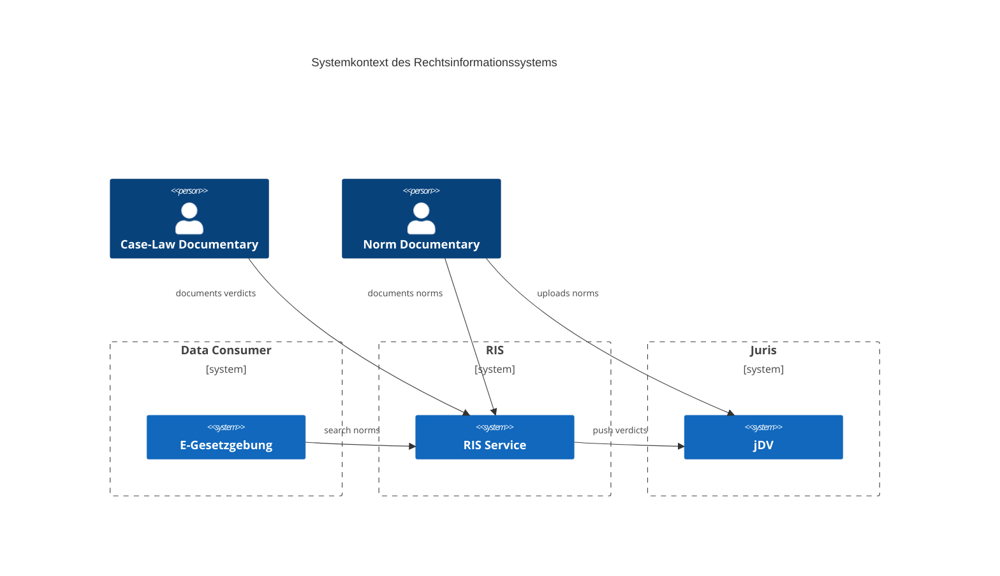

RIS system context C4 model

```mermaid
C4Context
    title Systemkontext des Rechtsinformationssystems

    Person(person_caselaw_documentary, "Case-Law Documentary")
    Person(person_norms_documentary, "Norm Documentary")


    Boundary(boundary_data_consumer, "Data Consumer") {
        System(system_e_gesetzgebung, "E-Gesetzgebung")
    }

    Boundary(boundary_ris, "RIS") {
        System(system_ris_service, "RIS Service")
    }

    Boundary(boundary_juris, "Juris") {
        System(system_jdv, "jDV")
    }


    Rel(person_norms_documentary, system_ris_service, "documents norms")
    Rel(person_norms_documentary, system_jdv, "uploads norms")
    Rel(person_caselaw_documentary, system_ris_service, "documents verdicts")
    Rel(system_ris_service, system_jdv, "push verdicts")
    Rel(system_e_gesetzgebung, system_ris_service, "search norms")

    UpdateRelStyle(person_caselaw_documentary, system_ris_service, $offsetY="-60", $offsetX="-250")
    UpdateRelStyle(person_norms_documentary, system_ris_service, $offsetY="-60", $offsetX="-140")
    UpdateRelStyle(person_norms_documentary, system_jdv, $offsetY="-60", $offsetX="-100")
    UpdateRelStyle(system_ris_service, system_jdv, $offsetY="-20", $offsetX="-50")
    UpdateRelStyle(system_e_gesetzgebung, system_ris_service, $offsetY="-20", $offsetX="-50")

    UpdateLayoutConfig($c4ShapeInRow="3", $c4BoundaryInRow="3")
```
