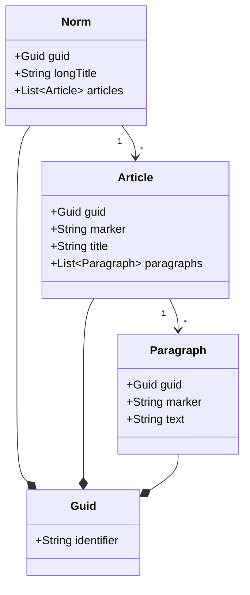

# Domain Model

```mermaid
classDiagram
  class Norm
  Norm : +Guid guid
  Norm : +String longTitle
  Norm : +List~Article~ articles

  class Guid
  Guid : +String identifier

  class Article
  Article : +Guid guid
  Article : +String marker
  Article : +String title
  Article : +List~Paragraph~ paragraphs

  class Paragraph
  Paragraph : +Guid guid
  Paragraph : +String marker
  Paragraph : +String text

  Norm --* Guid
  Article --* Guid
  Paragraph --* Guid
  Norm "1" --> "*" Article
  Article "1" --> "*" Paragraph
```
