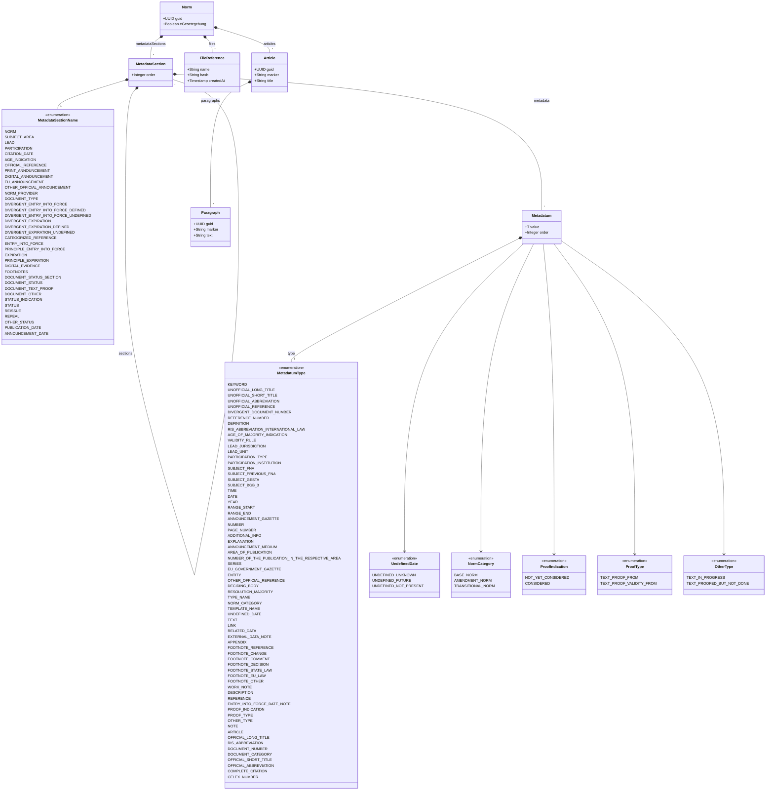

# Domain Model

```mermaid
classDiagram
  class Norm {
    +UUID guid
    +Boolean eGesetzgebung
  }

  Norm *-- "*" MetadataSection : metadataSections
  Norm *-- "*" FileReference : files
  Norm *-- "*" Article : articles

  class FileReference {
    +String name
    +String hash
    +Timestamp createdAt
  }

  class MetadataSection {
      +Integer order
  }

  MetadataSection *-- "1" MetadataSectionName
  MetadataSection *-- "*" MetadataSection : sections
  MetadataSection *-- "*" Metadatum : metadata

  class MetadataSectionName  {
     <<enumeration>>
     NORM
     SUBJECT_AREA
     LEAD
     PARTICIPATION
     CITATION_DATE
     AGE_INDICATION
     OFFICIAL_REFERENCE
     PRINT_ANNOUNCEMENT
     DIGITAL_ANNOUNCEMENT
     EU_ANNOUNCEMENT
     OTHER_OFFICIAL_ANNOUNCEMENT
     NORM_PROVIDER
     DOCUMENT_TYPE
     DIVERGENT_ENTRY_INTO_FORCE
     DIVERGENT_ENTRY_INTO_FORCE_DEFINED
     DIVERGENT_ENTRY_INTO_FORCE_UNDEFINED
     DIVERGENT_EXPIRATION
     DIVERGENT_EXPIRATION_DEFINED
     DIVERGENT_EXPIRATION_UNDEFINED
     CATEGORIZED_REFERENCE
     ENTRY_INTO_FORCE
     PRINCIPLE_ENTRY_INTO_FORCE
     EXPIRATION
     PRINCIPLE_EXPIRATION
     DIGITAL_EVIDENCE
     FOOTNOTES
     DOCUMENT_STATUS_SECTION
     DOCUMENT_STATUS
     DOCUMENT_TEXT_PROOF
     DOCUMENT_OTHER
     STATUS_INDICATION
     STATUS
     REISSUE
     REPEAL
     OTHER_STATUS
     PUBLICATION_DATE
     ANNOUNCEMENT_DATE
  }

  class Metadatum~T~ {
      +T value
      +Integer order
  }

  Metadatum *-- "1" MetadatumType : type
  Metadatum --> UndefinedDate
  Metadatum --> NormCategory
  Metadatum --> ProofIndication
  Metadatum --> ProofType
  Metadatum --> OtherType

  class MetadatumType  {
      <<enumeration>>
    KEYWORD
    UNOFFICIAL_LONG_TITLE
    UNOFFICIAL_SHORT_TITLE
    UNOFFICIAL_ABBREVIATION
    UNOFFICIAL_REFERENCE
    DIVERGENT_DOCUMENT_NUMBER
    REFERENCE_NUMBER
    DEFINITION
    RIS_ABBREVIATION_INTERNATIONAL_LAW
    AGE_OF_MAJORITY_INDICATION
    VALIDITY_RULE
    LEAD_JURISDICTION
    LEAD_UNIT
    PARTICIPATION_TYPE
    PARTICIPATION_INSTITUTION
    SUBJECT_FNA
    SUBJECT_PREVIOUS_FNA
    SUBJECT_GESTA
    SUBJECT_BGB_3
    TIME
    DATE
    YEAR
    RANGE_START
    RANGE_END
    ANNOUNCEMENT_GAZETTE
    NUMBER
    PAGE_NUMBER
    ADDITIONAL_INFO
    EXPLANATION
    ANNOUNCEMENT_MEDIUM
    AREA_OF_PUBLICATION
    NUMBER_OF_THE_PUBLICATION_IN_THE_RESPECTIVE_AREA
    SERIES
    EU_GOVERNMENT_GAZETTE
    ENTITY
    OTHER_OFFICIAL_REFERENCE
    DECIDING_BODY
    RESOLUTION_MAJORITY
    TYPE_NAME
    NORM_CATEGORY
    TEMPLATE_NAME
    UNDEFINED_DATE
    TEXT
    LINK
    RELATED_DATA
    EXTERNAL_DATA_NOTE
    APPENDIX
    FOOTNOTE_REFERENCE
    FOOTNOTE_CHANGE
    FOOTNOTE_COMMENT
    FOOTNOTE_DECISION
    FOOTNOTE_STATE_LAW
    FOOTNOTE_EU_LAW
    FOOTNOTE_OTHER
    WORK_NOTE
    DESCRIPTION
    REFERENCE
    ENTRY_INTO_FORCE_DATE_NOTE
    PROOF_INDICATION
    PROOF_TYPE
    OTHER_TYPE
    NOTE
    ARTICLE
    OFFICIAL_LONG_TITLE
    RIS_ABBREVIATION
    DOCUMENT_NUMBER
    DOCUMENT_CATEGORY
    OFFICIAL_SHORT_TITLE
    OFFICIAL_ABBREVIATION
    COMPLETE_CITATION
    CELEX_NUMBER
  }

  class UndefinedDate  {
     <<enumeration>>
    UNDEFINED_UNKNOWN
    UNDEFINED_FUTURE
    UNDEFINED_NOT_PRESENT
  }

  class NormCategory  {
     <<enumeration>>
    BASE_NORM
    AMENDMENT_NORM
    TRANSITIONAL_NORM
  }

  class ProofIndication  {
     <<enumeration>>
    NOT_YET_CONSIDERED
    CONSIDERED
  }

  class ProofType  {
     <<enumeration>>
    TEXT_PROOF_FROM
    TEXT_PROOF_VALIDITY_FROM
  }

  class OtherType  {
     <<enumeration>>
    TEXT_IN_PROGRESS
    TEXT_PROOFED_BUT_NOT_DONE
  }

  class Article {
    +UUID guid
    +String marker
    +String title
  }

  Article *-- "*" Paragraph : paragraphs

  class Paragraph {
    +UUID guid
    +String marker
    +String text
  }
```
