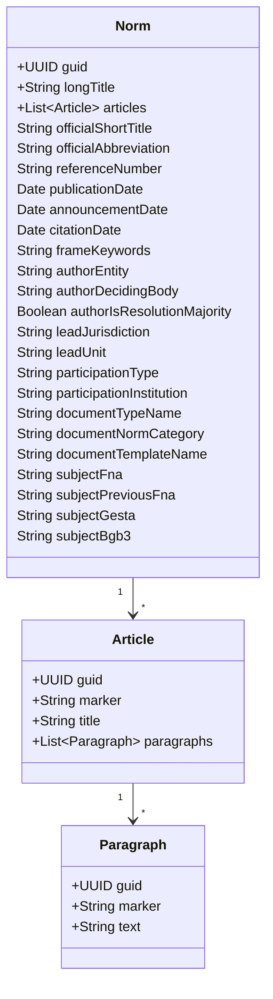

# Domain Model

```mermaid
classDiagram
  class Norm {
    +UUID guid
    +String longTitle
    +List~Article~ articles
    String officialShortTitle
    String officialAbbreviation
    String referenceNumber
    Date publicationDate
    Date announcementDate
    Date citationDate
    String frameKeywords
    String authorEntity
    String authorDecidingBody
    Boolean authorIsResolutionMajority
    String leadJurisdiction
    String leadUnit
    String participationType
    String participationInstitution
    String documentTypeName
    String documentNormCategory
    String documentTemplateName
    String subjectFna
    String subjectPreviousFna
    String subjectGesta
    String subjectBgb3
  }

  class Article {
    +UUID guid
    +String marker
    +String title
    +List~Paragraph~ paragraphs
  }

  class Paragraph {
    +UUID guid
    +String marker
    +String text
  }

  Norm "1" --> "*" Article
  Article "1" --> "*" Paragraph
```
