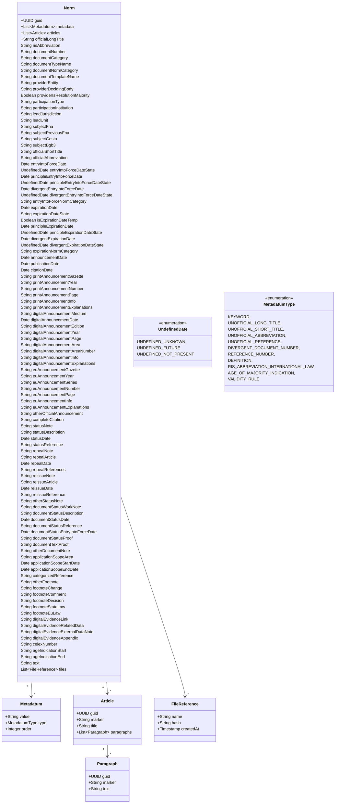

# Domain Model

```mermaid
classDiagram
  class Norm {
    +UUID guid
    +List~Metadatum~ metadata
    +List~Article~ articles

    +String officialLongTitle
    String risAbbreviation
    String documentNumber
    String documentCategory

    String documentTypeName
    String documentNormCategory
    String documentTemplateName

    String providerEntity
    String providerDecidingBody
    Boolean providerIsResolutionMajority

    String participationType
    String participationInstitution

    String leadJurisdiction
    String leadUnit

    String subjectFna
    String subjectPreviousFna
    String subjectGesta
    String subjectBgb3

    String officialShortTitle
    String officialAbbreviation

    Date entryIntoForceDate
    UndefinedDate entryIntoForceDateState
    Date principleEntryIntoForceDate
    UndefinedDate principleEntryIntoForceDateState
    Date divergentEntryIntoForceDate
    UndefinedDate divergentEntryIntoForceDateState
    String entryIntoForceNormCategory

    Date expirationDate
    String expirationDateState
    Boolean isExpirationDateTemp
    Date principleExpirationDate
    UndefinedDate principleExpirationDateState
    Date divergentExpirationDate
    UndefinedDate divergentExpirationDateState
    String expirationNormCategory

    Date announcementDate
    Date publicationDate

    Date citationDate

    String printAnnouncementGazette
    String printAnnouncementYear
    String printAnnouncementNumber
    String printAnnouncementPage
    String printAnnouncementInfo
    String printAnnouncementExplanations
    String digitalAnnouncementMedium
    Date digitalAnnouncementDate
    String digitalAnnouncementEdition
    String digitalAnnouncementYear
    String digitalAnnouncementPage
    String digitalAnnouncementArea
    String digitalAnnouncementAreaNumber
    String digitalAnnouncementInfo
    String digitalAnnouncementExplanations
    String euAnnouncementGazette
    String euAnnouncementYear
    String euAnnouncementSeries
    String euAnnouncementNumber
    String euAnnouncementPage
    String euAnnouncementInfo
    String euAnnouncementExplanations
    String otherOfficialAnnouncement

    String completeCitation

    String statusNote
    String statusDescription
    Date statusDate
    String statusReference
    String repealNote
    String repealArticle
    Date repealDate
    String repealReferences
    String reissueNote
    String reissueArticle
    Date reissueDate
    String reissueReference
    String otherStatusNote

    String documentStatusWorkNote
    String documentStatusDescription
    Date documentStatusDate
    String documentStatusReference
    Date documentStatusEntryIntoForceDate
    String documentStatusProof
    String documentTextProof
    String otherDocumentNote

    String applicationScopeArea
    Date applicationScopeStartDate
    Date applicationScopeEndDate

    String categorizedReference

    String otherFootnote
    String footnoteChange
    String footnoteComment
    String footnoteDecision
    String footnoteStateLaw
    String footnoteEuLaw

    String digitalEvidenceLink
    String digitalEvidenceRelatedData
    String digitalEvidenceExternalDataNote
    String digitalEvidenceAppendix

    String celexNumber

    String ageIndicationStart
    String ageIndicationEnd

    String text
    List~FileReference~ files
  }

  class Metadatum {
      +String value
      +MetadatumType type
      +Integer order
  }

  class Article {
    +UUID guid
    +String marker
    +String title
    +List~Paragraph~ paragraphs
  }

  class Paragraph {
    +UUID guid
    +String marker
    +String text
  }


  class UndefinedDate  {
     <<enumeration>>
    UNDEFINED_UNKNOWN
    UNDEFINED_FUTURE
    UNDEFINED_NOT_PRESENT
  }

  class MetadatumType  {
      <<enumeration>>
      KEYWORD,
      UNOFFICIAL_LONG_TITLE,
      UNOFFICIAL_SHORT_TITLE,
      UNOFFICIAL_ABBREVIATION,
      UNOFFICIAL_REFERENCE,
      DIVERGENT_DOCUMENT_NUMBER,
      REFERENCE_NUMBER,
      DEFINITION,
      RIS_ABBREVIATION_INTERNATIONAL_LAW,
      AGE_OF_MAJORITY_INDICATION,
      VALIDITY_RULE
  }

  class FileReference {
    +String name
    +String hash
    +Timestamp createdAt
  }

  Norm "1" --> "*" Metadatum
  Norm "1" --> "*" Article
  Article "1" --> "*" Paragraph
  Norm "1" --> "*" FileReference
```
