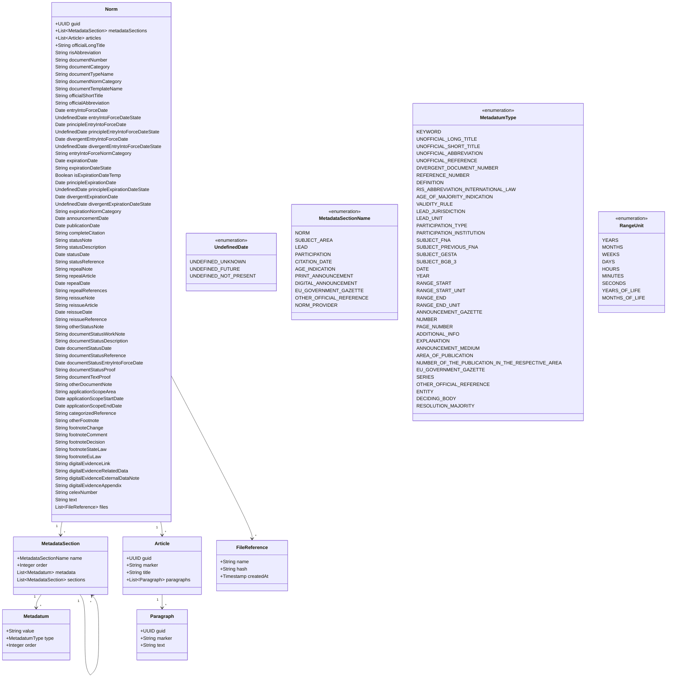

# Domain Model

```mermaid
classDiagram
  class Norm {
    +UUID guid
    +List~MetadataSection~ metadataSections
    +List~Article~ articles

    +String officialLongTitle
    String risAbbreviation
    String documentNumber
    String documentCategory

    String documentTypeName
    String documentNormCategory
    String documentTemplateName

    String officialShortTitle
    String officialAbbreviation

    Date entryIntoForceDate
    UndefinedDate entryIntoForceDateState
    Date principleEntryIntoForceDate
    UndefinedDate principleEntryIntoForceDateState
    Date divergentEntryIntoForceDate
    UndefinedDate divergentEntryIntoForceDateState
    String entryIntoForceNormCategory

    Date expirationDate
    String expirationDateState
    Boolean isExpirationDateTemp
    Date principleExpirationDate
    UndefinedDate principleExpirationDateState
    Date divergentExpirationDate
    UndefinedDate divergentExpirationDateState
    String expirationNormCategory

    Date announcementDate
    Date publicationDate

    String completeCitation

    String statusNote
    String statusDescription
    Date statusDate
    String statusReference
    String repealNote
    String repealArticle
    Date repealDate
    String repealReferences
    String reissueNote
    String reissueArticle
    Date reissueDate
    String reissueReference
    String otherStatusNote

    String documentStatusWorkNote
    String documentStatusDescription
    Date documentStatusDate
    String documentStatusReference
    Date documentStatusEntryIntoForceDate
    String documentStatusProof
    String documentTextProof
    String otherDocumentNote

    String applicationScopeArea
    Date applicationScopeStartDate
    Date applicationScopeEndDate

    String categorizedReference

    String otherFootnote
    String footnoteChange
    String footnoteComment
    String footnoteDecision
    String footnoteStateLaw
    String footnoteEuLaw

    String digitalEvidenceLink
    String digitalEvidenceRelatedData
    String digitalEvidenceExternalDataNote
    String digitalEvidenceAppendix

    String celexNumber

    String text
    List~FileReference~ files
  }

  class Metadatum {
      +String value
      +MetadatumType type
      +Integer order
  }

  class MetadataSection {
      +MetadataSectionName name
      +Integer order
      List~Metadatum~ metadata
      List~MetadataSection~ sections
  }

  class Article {
    +UUID guid
    +String marker
    +String title
    +List~Paragraph~ paragraphs
  }

  class Paragraph {
    +UUID guid
    +String marker
    +String text
  }


  class UndefinedDate  {
     <<enumeration>>
    UNDEFINED_UNKNOWN
    UNDEFINED_FUTURE
    UNDEFINED_NOT_PRESENT
  }

  class MetadataSectionName  {
     <<enumeration>>
     NORM
     SUBJECT_AREA
     LEAD
     PARTICIPATION
     CITATION_DATE
     AGE_INDICATION
     PRINT_ANNOUNCEMENT
     DIGITAL_ANNOUNCEMENT
     EU_GOVERNMENT_GAZETTE
     OTHER_OFFICIAL_REFERENCE
     NORM_PROVIDER
  }

  class MetadatumType  {
      <<enumeration>>
      KEYWORD
      UNOFFICIAL_LONG_TITLE
      UNOFFICIAL_SHORT_TITLE
      UNOFFICIAL_ABBREVIATION
      UNOFFICIAL_REFERENCE
      DIVERGENT_DOCUMENT_NUMBER
      REFERENCE_NUMBER
      DEFINITION
      RIS_ABBREVIATION_INTERNATIONAL_LAW
      AGE_OF_MAJORITY_INDICATION
      VALIDITY_RULE
      LEAD_JURISDICTION
      LEAD_UNIT
      PARTICIPATION_TYPE
      PARTICIPATION_INSTITUTION
      SUBJECT_FNA
      SUBJECT_PREVIOUS_FNA
      SUBJECT_GESTA
      SUBJECT_BGB_3
      DATE
      YEAR
      RANGE_START
      RANGE_START_UNIT
      RANGE_END
      RANGE_END_UNIT
      ANNOUNCEMENT_GAZETTE
      NUMBER
      PAGE_NUMBER
      ADDITIONAL_INFO
      EXPLANATION
      ANNOUNCEMENT_MEDIUM
      AREA_OF_PUBLICATION
      NUMBER_OF_THE_PUBLICATION_IN_THE_RESPECTIVE_AREA
      EU_GOVERNMENT_GAZETTE
      SERIES
      OTHER_OFFICIAL_REFERENCE
      ENTITY
      DECIDING_BODY
      RESOLUTION_MAJORITY
  }

  class FileReference {
    +String name
    +String hash
    +Timestamp createdAt
  }

  class RangeUnit {
    <<enumeration>>
    YEARS
    MONTHS
    WEEKS
    DAYS
    HOURS
    MINUTES
    SECONDS
    YEARS_OF_LIFE
    MONTHS_OF_LIFE
  }

  Norm "1" --> "*" MetadataSection
  Norm "1" --> "*" Article
  Norm "1" --> "*" FileReference
  Article "1" --> "*" Paragraph
  MetadataSection "1" --> "*" Metadatum
  MetadataSection "1" --> "*" MetadataSection
```
